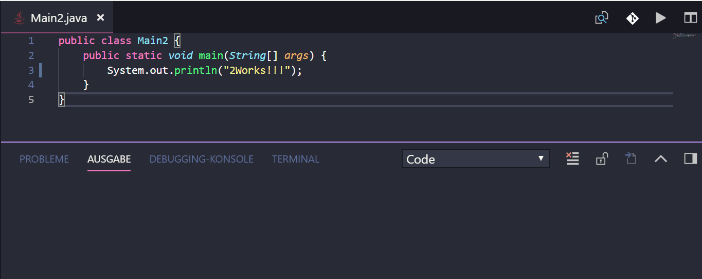

# Java Beispiel
## Voraussetzungen
Ein Java JDK muss richtig installiert sein und in der *PATH* Variablen *javac.exe* verknüpft sein. Ferner sollte die *JAVA_HOME* Variable auf das JDK richtig gesetzt sein
## Möglichkeit 1

Dazu ist die Extension [Code Runner](https://marketplace.visualstudio.com/items?itemName=formulahendry.code-runner) installiert werden.

Der Java Code kann dann einfach über das Pfeil Symbol ausgeführt werden.



## Möglichkeit 2
Über eine Build Task kann das Kompilieren des Java Codes gestartet werden, ein build Task kann z.B. wie folgt aussehen:

```
{
    // See https://go.microsoft.com/fwlink/?LinkId=733558
    // for the documentation about the tasks.json format
    "version": "2.0.0",
    "tasks": [
            "label": "Compile all Java Files",
            "command": "java",
            "windows": {
                "command": "${env:JAVA_HOME}\\bin\\javac.exe"
            },
            "args": [
                "*.java"
            ],
            "group": {
                "kind": "build",
                "isDefault": true
            },
          
            "problemMatcher": {
                "owner": "external",
                "fileLocation": ["absolute"],
                "pattern": [
                    {
                        "regexp": "^(.+\\.java):(\\d):(?:\\s+(error)):(?:\\s+(.*))$",
                        "file": 1,
                        "location": 2,
                        "severity": 3,
                        "message": 4
                    }
                ]
            }
           
        }
    ]
} 
```
Dieser Build Task kann gestartet werden mittels *STRG+SHIFT+B*. Über die Konsole kann anschließend die kompilierte JAVA Klasse mit *java Klassenbezeichnung* gestartet werden.

Will mann das Programm starten benötigt man einen weiteren Task..:
```
       {
            "label": "Run Java Programm",
            "type": "shell",
            "command": "${env:JAVA_HOME}\\bin\\java.exe",
            "args": [
                "Main2"
            ],
            "presentation": {
                "echo": true,
                "reveal": "always",
                "focus": false,
                "panel": "shared",
                "showReuseMessage": true
            }
        } 
```


## Tipps
Damit die kompilierten class Dateien nicht im Editor erscheinen, können diese ausgebelden werden über folgenden Eintrag in den Einstellungen:
```
     "files.exclude": {
         "*.class":true
     },

```


## Snippets
```js
{
    "Main Class": {
		"prefix": "main",
		"body": [
			"public class $1 {",
			"public static void main(String[] args) {",
			"$2",
			"}",
			"}"
		],
		"description": "Main Class"
	},
	"Println to console": {
		"prefix": "sopl",
		"body": [
			"System.out.println(\"$1\");"
		],
		"description": "System.out.println()"
	},
	"Print to console": {
		"prefix": "sop",
		"body": [
			"System.out.print(\"$1\");"
		],
		"description": "System.out.print()"
    }
}
```
